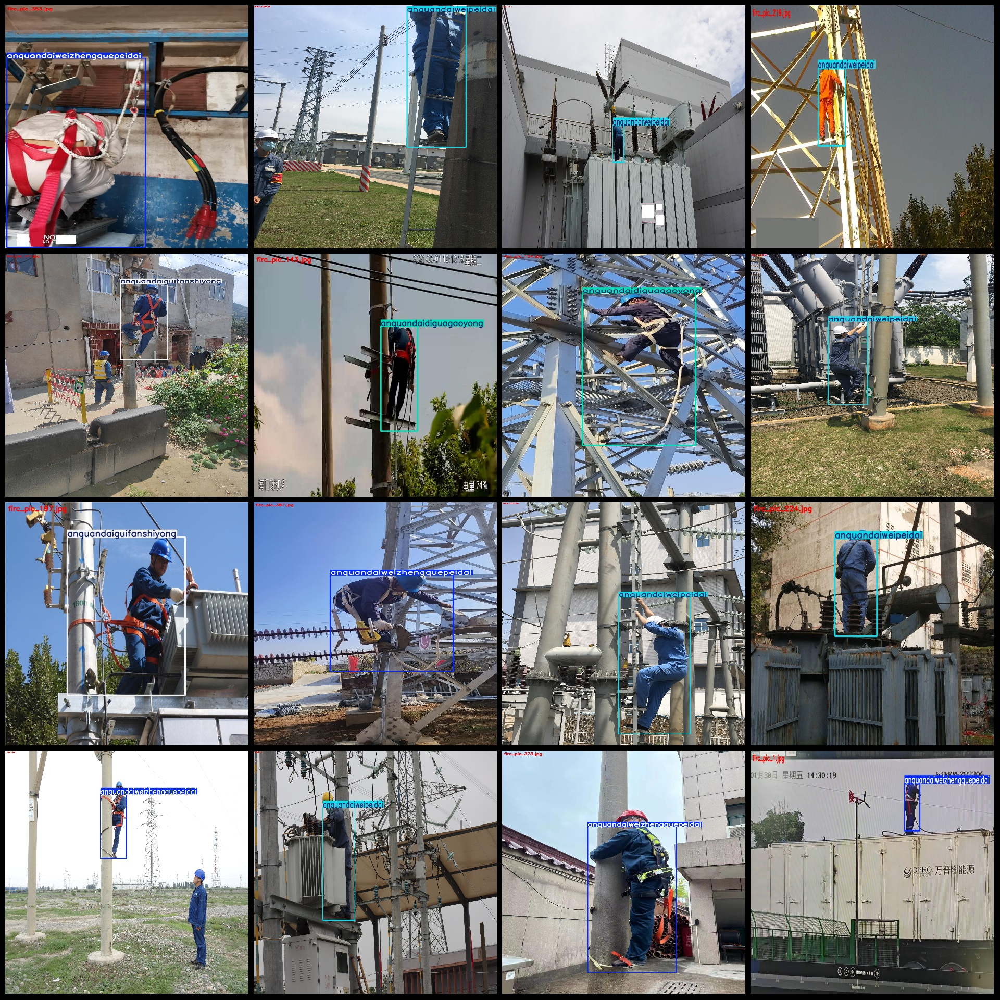
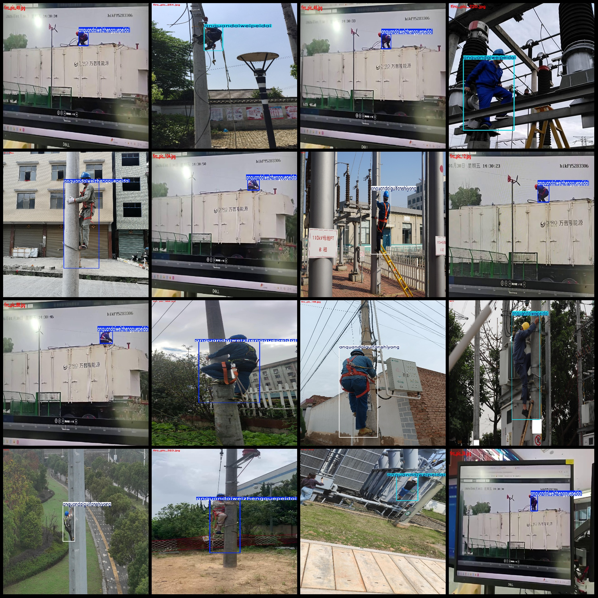

# Power Industry High-Altitude Workplace Hazard Identification and Safety Belt Wear Standards Detection Data Set VOC+YOLO Format 359 Categories

The dataset format is Pascal VOC format + YOLO format (without the split path, only the txt files containing jpg images and corresponding VOC format xml files and yolo format txt files).

number of images: 395
The number of XML files is 395.
The number of txt files is 395.
annotationnumber of classes: 4
annotation class names: ["anquandaiguageyong", "anquandaiguifanshiyong", "anquandaiweipeidai", "anquandaiweizhengquepeidai"]
["Low hanging high use of seatbelt", "Seatbelt usage standard", "Seatbelt not worn", "Seatbelt not correctly worn"]
The number of bounding boxes per category:
anquandaidiguagaoyong box count = 33
anquandaiguifanshiyong box count = 67
anquandaiweipeidai box count = 97
anquandaiweizhengquepeidai box count = 198
total boxes: 395
images per class: 
The number of images owned by Anquandaidiguagaoyong is 33.
anquandaiguifanshiyong images = 67
anquandaiweipeidai images = 97
anquandaiweizhengquepeidai images = 198
The image resolution is multi-resolution images, such as 1920x1080, 1920x1920, etc.
The annotation tool used is labelImg.
Annotation rules: draw a rectangle box around the class.
Important notes: The dataset does not have a training validation test set to be divided; you need to divide it yourself.
Special statement: This dataset does not guarantee any accuracy for the trained model or weight file.
Image preview:
## Images

Here is a pay link on Stripe ( https://buy.stripe.com/3cs8yP7sY87d0vu9AB ). Please contact me lonlonago@foxmail.com after funding $89, and I will send you a complete data files , thank you!

